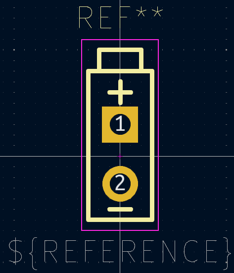

# Wired Battery Connector

Harry Boyd - hboyd255@gmail.com - 21/05/2024

This is a KiCad footprint for a simple wired battery connector.

This connector is designed to be be soldered to a wired battery pack, like the
ones connected to 9v battery connectors.

## Footprint

